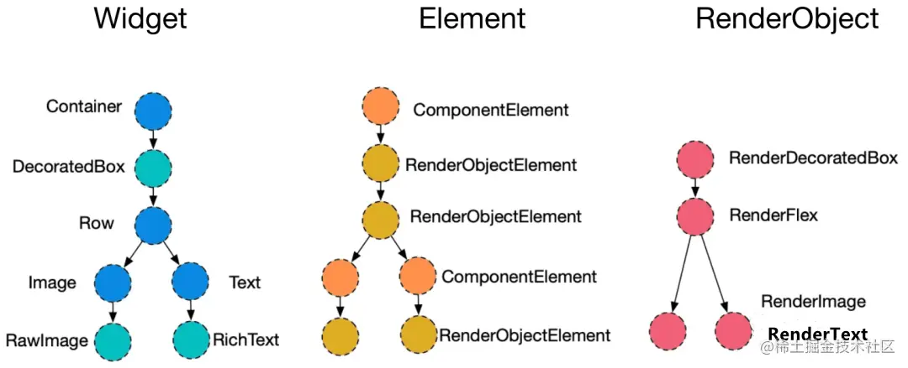

## flutter 的架构


Framework 使用 dart 实现主要提供我们开发用的 API Engine 使用 C++实现，主要包括:Skia,Dart 和 Text。Skia 是开源的二维图形库，提供了适用于多种软硬件平台的通用 API Embedder 是一个嵌入层，即把 Flutter 嵌入到各个平台上去，这里做的主要工作包括渲染 Surface 设置,线程设置，以及插件等

## Flutter 线程

flutter 里面有四个线程分别是 UI 线程，GPU 线程，IO 线程，Platform 线程

-   UI 线程运行 dart 代码，我们写的代码都是在这个线程运行
-   GPU 线程被用于执行设备 GPU 的相关调用
-   IO 线程主要功能是从图片存储（比如磁中读取压缩的图片格式，将图片数据进行处理为 GPU Runner 的渲染做好准备
-   Platform 线程主要负责和 Engine 的所有交互

我们主要关注 UI 线程和 GPU 线程的性能问题就可以了，其他两个主要跟底层交互多

## 渲染结构




在 Flutter 中，Widget 树、Element 树和 Render 树是三个紧密相关的层次结构，它们共同协作以构建和渲染应用界面。下面是它们之间的关系：

1. **Widget 树 (Widget Tree)**:

    - Widget 树是由 Widget 组成的，它是一个不可变的配置描述，代表了界面的结构和配置。
    - Widget 是用于构建 UI 的基本构建块，它们是轻量级的，主要用于配置数据和定义界面。
    - 当 Widget 的配置发生变化时，Flutter 会创建一个新的 Widget 实例来替换旧的。

2. **Element 树 (Element Tree)**:

    - Element 树是 Widget 树的实例化，它是一个中间层，用于连接 Widget 层和 Render 层。
    - Element 是 Widget 的具体实例，它持有 Widget 的运行时信息，并负责管理 Widget 的生命周期。
    - Element 树是可变的，当 Widget 树更新时，Element 树会相应地进行调整，但尽可能地复用现有的 Element。

3. **Render 树 (Render Tree)**:
    - Render 树是由 RenderObject 组成的，它负责具体的布局和绘制工作。
    - RenderObject 是一个抽象类，具体的布局和绘制逻辑由它的子类（如 RenderBox）实现。
    - Render 树是 Element 树的具体表现，每个 Element 对应一个 RenderObject，Element 会将 Widget 的配置应用到其对应的 RenderObject 上。

这三棵树的关系可以概括为：

-   **Widget 树定义了 UI 的结构和配置**，它是声明式的，当我们编写 Flutter 代码时，我们实际上是在构建 Widget 树。
-   **Element 树是 Widget 树的实例化**，它是框架在内部用来管理 Widget 的状态和生命周期的。
-   **Render 树负责实际的布局和绘制**，它是 Element 树的具体表现，将 UI 实际渲染到屏幕上。

当应用的状态发生变化，导致 Widget 树更新时，Flutter 框架会进行一系列的操作来更新 Element 树和 Render 树，以确保 UI 的正确渲染。这个过程包括 Widget 的构建（build）、Element 的更新（update）和 RenderObject 的布局（layout）与绘制（paint）。

## Flutter 的渲染原理和流程


整体可以概括为以下几个步骤：

1. **构建 Widget 树 (Build)**:

    - 开发者编写的代码定义了一系列 Widget，这些 Widget 组合起来形成了一个 Widget 树。
    - 当状态变化时，Flutter 会调用 `build` 方法来重建 Widget 树的一部分。

2. **生成 Element 树 (Update)**:

    - 对于 Widget 树中的每一个 Widget，Flutter 都会创建或更新对应的 Element。
    - Element 树是 Widget 树的一个实例化，它维护了 Widget 的状态和在树中的位置。

3. **创建和更新 Render 树 (Layout & Paint)**:

    - Element 对应的 Widget 会创建或更新其 RenderObject。
    - RenderObject 负责具体的布局（Layout）和绘制（Paint）工作。
    - 布局阶段，RenderObject 会根据自身和子 RenderObject 的约束计算出每个对象的大小和位置。
    - 绘制阶段，RenderObject 将自身的视觉表现绘制到屏幕上。

4. **合成和显示 (Compositing & Display)**:

    - 绘制操作不是直接在屏幕上进行的，而是在一个层级结构中完成的，这个结构被称为 Layer 树。
    - Layer 树允许 Flutter 进行高效的合成操作，因为可以独立地重绘或移动层，而不需要重绘整个界面。
    - 最后，Layer 树被提交到引擎的合成器，合成器将 Layer 树转换成 GPU 命令，最终显示在屏幕上。

## flutter 运行模式

### Debug

Debug 模式可以在真机和模拟器上同时运行：会打开所有的断言，包括 debugging 信息、debugger aids（比如 observatory）和服务扩展。优化了快速 develop/run 循环，但是没有优化执行速度、二进制大小和部署。命令 flutter run 就是以这种模式运行的，通过 sky/tools/gn --android 或者 sky/tools/gn --ios 来 build。有时候也被叫做“checked 模式”或者“slow 模式”。

## Release

Release 模式只能在真机上运行，不能在模拟器上运行：会关闭所有断言和 debugging 信息，关闭所有 debugger 工具。优化了快速启动、快速执行和减小包体积。禁用所有的 debugging aids 和服务扩展。这个模式是为了部署给最终的用户使用。命令 flutter run --release 就是以这种模式运行的，通过 sky/tools/gn --android --runtime-mode=release 或者 sky/tools/gn --ios --runtime-mode=release 来 build。

## Profile

Profile 模式只能在真机上运行，不能在模拟器上运行：基本和 Release 模式一致，除了启用了服务扩展和 tracing，以及一些为了最低限度支持 tracing 运行的东西（比如可以连接 observatory 到进程）。命令 flutter run --profile 就是以这种模式运行的，通过 sky/tools/gn --android --runtime-mode=profile 或者 sky/tools/gn --ios --runtime-mode=profile```来 build。因为模拟器不能代表真实场景，所以不能在模拟器上运行。
test 模式只能在桌面上运行：基本和 Debug 模式一致，除了是 headless 的而且你能在桌面运行。命令 flutter test 就是以这种模式运行的，通过 sky/tools/gn 来 build。

建议在 Profile 模式下测试性能

## 调试性能

-   1、vscode 安装 dart 插件。
-   2、如果要调试性能，就需要以 profile 方式运行，否则会有警告弹窗。profile 模式启动必须需要真机
-   3、然后就可以打开性能调试工具：


选择对应的面板：


-   4、优化 build：

点击 Performance 里面的 EnhanceTracing 选中 Track Widget Builds


然后就可以看到录制的帧性能的 timeline。其中橙红色打标慢帧，点击可以看到具体的性能分析：


可以看到 build 时间很长


层级太多了，需要优化下

-   5、优化 paint:

点击 Performance 里面的 EnhanceTracing 选中 Track Paints


可以看到层级也很多


## 优化措施

Flutter 的渲染流程是高度优化的，但开发者仍然可以采取一些措施来进一步优化性能：

### 使用 `const`减少不必要的 Widget rebuild

这样做的好处包括：

1. **减少内存分配**：每次重建 Widget 都会涉及到内存分配。使用 const 可以避免不必要的内存分配，因为常量 Widget 只会在第一次使用时分配内存。
2. **提高性能**：减少重建可以减少 CPU 的工作量，特别是在滚动列表或者有大量静态内容的情况下，这可以提高应用的整体性能。
3. **避免不必要的渲染**：如果 Widget 没有变化，那么它的渲染输出也不会变化。避免重建可以减少对渲染层的不必要操作，从而减少对 GPU 的工作量。

### 减少 Widget 树的深度和复杂度，移除不必要的嵌套和容器；

### 使用 `ListView.builder`、`GridView.builder` 等构建方法来惰性加载列表项

它不会一次性构建所有的列表项，而是只构建那些实际需要显示在屏幕上的列表项。当用户滚动列表时，`ListView.builder` 会根据当前的滚动位置动态构建新的列表项，并且回收不再显示在屏幕上的列表项的资源。

`ListView.builder` 需要两个主要的参数：

1. `itemBuilder`: 这是一个函数，它会在需要新的列表项时被调用。它接收上下文（`BuildContext`）和索引（`index`），并且返回一个新的列表项（`Widget`）。
2. `itemCount`: 列表中的总项数。

当用户滚动列表时，Flutter 渲染引擎会计算哪些列表项应该显示在屏幕上，并且调用 `itemBuilder` 来构建这些列表项。这种方式意味着如果列表很长或者无限，回收的列表项通常是被销毁的，而不是被直接复用。当一个列表项滚动出屏幕并且不再可见时，它的状态和关联的资源会被销毁。然而，Flutter 的渲染层会尽可能高效地处理这个过程。

如上示例中，原有滚动通过`SingleChildScrollView`来实现，查看 build 耗时：


修改为`ListView.builder`实现后，build 耗时：


明显降低。

### 合并 widget

如果可能，将多个小 widget 合并成一个自定义 widget，减少层级。

在实际工作场景中，合并 `Widget` 以提升性能的一个常见例子是在构建列表时。当你有一个包含大量列表项的 `ListView`，而每个列表项都由多个 `Widget` 组成时，合并这些 `Widget` 可以减少布局计算的复杂性和提高滚动性能。

例如，假设我们有一个社交媒体应用，显示一个帖子列表，每个帖子包含一个头像、用户名、发布时间、帖子内容和一排操作按钮（点赞、评论、分享）。在不合并 `Widget` 的情况下，每个列表项可能由多个 `Row`、`Column`、`Padding`、`Icon` 和 `Text` `Widget` 组成。

```dart
class PostItem extends StatelessWidget {
  final String avatarUrl;
  final String username;
  final String postTime;
  final String content;

  PostItem({
    required this.avatarUrl,
    required this.username,
    required this.postTime,
    required this.content,
  });

  @override
  Widget build(BuildContext context) {
    return Padding(
      padding: const EdgeInsets.all(10.0),
      child: Column(
        crossAxisAlignment: CrossAxisAlignment.start,
        children: <Widget>[
          Row(
            children: <Widget>[
              CircleAvatar(backgroundImage: NetworkImage(avatarUrl)),
              SizedBox(width: 10),
              Column(
                crossAxisAlignment: CrossAxisAlignment.start,
                children: <Widget>[
                  Text(username),
                  Text(postTime),
                ],
              ),
            ],
          ),
          SizedBox(height: 10),
          Text(content),
          SizedBox(height: 10),
          Row(
            children: <Widget>[
              IconButton(icon: Icon(Icons.thumb_up), onPressed: () {}),
              IconButton(icon: Icon(Icons.comment), onPressed: () {}),
              IconButton(icon: Icon(Icons.share), onPressed: () {}),
            ],
          ),
        ],
      ),
    );
  }
}
```

在这个例子中，每个 `PostItem` 包含多个 `Widget`，这些 `Widget` 在列表滚动时都需要重新布局和绘制。如果列表很长，这可能会导致性能问题。

为了优化性能，我们可以考虑合并一些 `Widget`。例如，我们可以创建一个自定义的 `PostItem` `Widget`，它直接在 `Canvas` 上绘制用户名、发布时间和帖子内容，而不是使用单独的 `Text` `Widget`。

```dart
class PostItem extends StatelessWidget {
  final String avatarUrl;
  final String username;
  final String postTime;
  final String content;

  PostItem({
    required this.avatarUrl,
    required this.username,
    required this.postTime,
    required this.content,
  });

  @override
  Widget build(BuildContext context) {
    return CustomPaint(
      painter: _PostItemPainter(
        avatarUrl: avatarUrl,
        username: username,
        postTime: postTime,
        content: content,
      ),
      size: Size(MediaQuery.of(context).size.width, calculatePostItemHeight(content)),
    );
  }
}

class _PostItemPainter extends CustomPainter {
  final String avatarUrl;
  final String username;
  final String postTime;
  final String content;

  _PostItemPainter({
    required this.avatarUrl,
    required this.username,
    required this.postTime,
    required this.content,
  });

  @override
  void paint(Canvas canvas, Size size) {
    // 绘制头像、用户名、发布时间、帖子内容和操作按钮
    // ...
  }

  @override
  bool shouldRepaint(covariant CustomPainter oldDelegate) {
    return false;
  }
}

double calculatePostItemHeight(String content) {
  // 根据内容计算帖子项的高度
  // ...
  return 100.0; // 示例高度值
}
```

在这个优化后的例子中，我们通过自定义绘制减少了 `Widget` 的数量，这样可以减少布局和绘制的开销，尤其是在滚动列表时。这种方法可以提高性能，但也会牺牲代码的可读性和可维护性。因此，只有在确定性能瓶颈确实存在时，才应该采取这种优化措施。比如

### 使用 `RepaintBoundary` 来隔离那些需要重绘的部分，减少整体的重绘成本。

`RepaintBoundary` 是 Flutter 中的一个小部件，它可以创建一个新的绘制层（layer），这样就可以限制重绘操作在这个层内进行，而不会影响到其他层。这对于性能优化特别有用，尤其是当你有一个复杂的小部件树，其中只有一小部分需要频繁重绘时。比如倒计时。

例如，假设你有一个滚动列表，其中的每个项目都有一些复杂的背景装饰，但是这些装饰在滚动时不会改变。你可以使用 `RepaintBoundary` 来包裹这些装饰，这样在滚动列表时，Flutter 只需要重绘列表项的内容，而不是整个项目。

关于渲染流程：

Flutter 中的三棵树(Widget,Element,RenderObject)

状态更新：
Flutter 中两种状态更新，StatelessWidge 和 StatefulWidget，StatefulWidget 部调用 setState,等到下一次 Vsycn 信号过来就会重建更新状态了。


三棵树中 Widget 和 Element 的节点是一一对应，而 RenderObject 是少于或等于 Widget 的数量的。当 Widget 是 RenderObjectWidget 的派生类的时候才有对应的 RenderObject。Element 和 RenderObject 在某些条件下是可以复用的，


从上图可以看出`Flutter`绘制一帧的任务会先构建三棵树然后再去绘制，`Widget`和`Element`的并不会重新创建，生命方法也不会重复调用（解决构建耗时性能问题，但是`widget`的`build`和`element`的`update`会被调用），但是在不使用 RepaintBoundary 的情况下 RenderObject 中的 paint 方法会被频繁调用（当`setState`触发了 Widget 树的重建，并且这个重建影响了 Widget 的视觉表现时，相关的`RenderObject`会被标记为需要重绘（dirty）。在下一个动画帧，Flutter 的渲染管线会重新绘制那些被标记为 dirty 的`RenderObject`，这时`RenderObject`的`paint`方法会被调用，以便在屏幕上重新渲染它们的视觉表现。）,接下来我们学习一下``Flutter`是怎么提升绘制性能的。

`RepaintBoundary`是集继承`SingleChildRenderObjectWidget`,也属于 `RenderObjectWidget`的派生类，所以`RepaintBoundary`也会有对应的 `RenderObject`。

```dart
class RepaintBoundary extends SingleChildRenderObjectWidget {
    ...
    @override
    RenderRepaintBoundary createRenderObject(BuildContext context) =>
      RenderRepaintBoundary();
}
```

`RepaintBoundary`中创建的`RenderObject`是`RenderRepaintBoundary`,下面是 `RenderRepaintBoundary`的代码:

```dart
class RenderRepaintBoundary extends RenderProxyBox {
  /// Creates a repaint boundary around [child].
  RenderRepaintBoundary({ RenderBox? child }) : super(child);

  @override
  bool get isRepaintBoundary => true;
}
```

`isRepaintBoundary`是 true

而不同的`renderObject`中：

```dart
abstract class RenderObject with DiagnosticableTreeMixin implements HitTestTarget {
    bool get isRepaintBoundary => false;
}
```

在 Flutter 中，`RenderObject`是一个基础类，用于创建和管理渲染树中的对象。`isRepaintBoundary`是`RenderObject`类中的一个属性，它表示该对象是否是一个重绘边界（repaint boundary）。

当`isRepaintBoundary`设置为`true`时，表示该`RenderObject`将在渲染树中创建一个新的绘制层（layer）。这意味着如果该对象或其任何子对象需要重绘，那么只有这个层会被重绘，而不是整个渲染树。这有助于提高性能，因为它减少了不必要的绘制操作。

`RenderRepaintBoundary`是`RenderObject`的一个子类，它默认将`isRepaintBoundary`设置为`true`。这是因为`RenderRepaintBoundary`的目的就是提供一个明确的重绘边界，以便在其内部的子树需要重绘时，只重绘该子树而不影响外部的渲染树。这通常用于优化性能，特别是在有复杂 UI 或频繁重绘的场景中。

在 ListView.builder 中可以看到使用了`SliverChildBuilderDelegate`,在它的 build 方法中就可以看到使用来实现列表 item 之间的独立渲染：

```dart
@override
@pragma('vm:notify-debugger-on-exception')
Widget? build(BuildContext context, int index) {
if (index < 0 || (childCount != null && index >= childCount!)) {
    return null;
}
Widget? child;
try {
    child = builder(context, index);
} catch (exception, stackTrace) {
    child = _createErrorWidget(exception, stackTrace);
}
if (child == null) {
    return null;
}
final Key? key = child.key != null ? _SaltedValueKey(child.key!) : null;
if (addRepaintBoundaries) {
    child = RepaintBoundary(child: child);
}
if (addSemanticIndexes) {
    final int? semanticIndex = semanticIndexCallback(child, index);
    if (semanticIndex != null) {
    child = IndexedSemantics(index: semanticIndex + semanticIndexOffset, child: child);
    }
}
if (addAutomaticKeepAlives) {
    child = AutomaticKeepAlive(child: _SelectionKeepAlive(child: child));
}
return KeyedSubtree(key: key, child: child);
}
```

下面是一个简单的代码示例：
https://juejin.cn/post/7047809275409891359
